# メモリ

mgbaではメモリに関連する構造体は`SM83Memory`と`GBMemory`の2つがあります。



```c++
struct SM83Memory {
	uint8_t (*cpuLoad8)(struct SM83Core*, uint16_t address);
	uint8_t (*load8)(struct SM83Core*, uint16_t address);
	void (*store8)(struct SM83Core*, uint16_t address, int8_t value);

	int (*currentSegment)(struct SM83Core*, uint16_t address);

	// GBCartLoad8で読み出すメモリ領域を表す配列
	const uint8_t* activeRegion;
	uint16_t activeMask;
	uint16_t activeRegionEnd;
	void (*setActiveRegion)(struct SM83Core*, uint16_t address);
};


```c++
struct GBMemory {
	uint8_t* rom;
	uint8_t* romBase;
	uint8_t* romBank;

    // mbc
	enum GBMemoryBankControllerType mbcType;
	GBMemoryBankControllerWrite mbcWrite;
	GBMemoryBankControllerRead mbcRead;
	union GBMBCState mbcState;

	int currentBank;
	int currentBank0;
	unsigned cartBusDecay;
	uint16_t cartBusPc;
	uint8_t cartBus;

	uint8_t* wram;
	uint8_t* wramBank;
	int wramCurrentBank;

	bool sramAccess;
	bool directSramAccess;
	uint8_t* sram;
	uint8_t* sramBank;
	int sramCurrentBank;

	uint8_t io[GB_SIZE_IO];
	bool ime;
	uint8_t ie;

	uint8_t hram[GB_SIZE_HRAM];

	uint16_t dmaSource;
	uint16_t dmaDest;
	int dmaRemaining;

	uint16_t hdmaSource;
	uint16_t hdmaDest;
	int hdmaRemaining;
	bool isHdma;

	struct mTimingEvent dmaEvent;
	struct mTimingEvent hdmaEvent;

	size_t romSize;

	bool rtcAccess;
	int activeRtcReg;
	bool rtcLatched;
	uint8_t rtcRegs[5];
	time_t rtcLastLatch;
	struct mRTCSource* rtc;
	struct mRotationSource* rotation;
	struct mRumble* rumble;
	struct mImageSource* cam;
};
```
